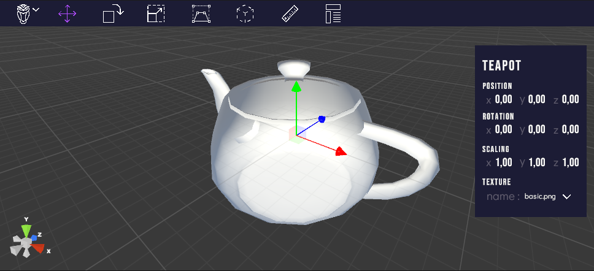

# OwlViewer

 This project was done for an assignment in computer graphics. It's a 3d model viewer made with unity. It can import `.obj` and `.stl` files, it can apply texture to them and it can apply various transformation (translation, rotation, scaling...) to them.

